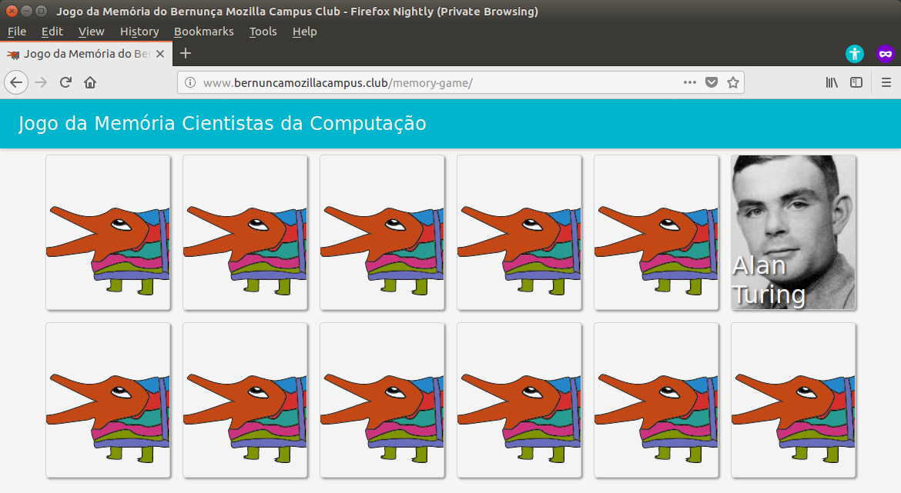

Memory Game
====

A memory game with Computer Science related topics.

Play here: http://bernunca.github.io/memory-game

### Runing the game in develop mode

```bash
yarn run start
```


Jogo da Memória
==== 

Um jogo da memória com tópicos relacionados à Ciência da Computação.

Para jogar: http://bernunca.github.io/memory-game

### Runing the game in develop mode

```bash
yarn run start
```

### Ajudando no desenvolvimento

Precisamos de ajuda para adicionar mais dados e melhor este projeto.

A primeira versão deste jogo contém apenas cientistas da computação e só funciona em português. Planejamos incluir outros tópicos e adicionar outros idiomas.



Veja as regras para colaborar com este projeto no tópico [CONTRIBUTING.md (en)](CONTRIBUTING.md). Além de [abrir novos tickets](https://github.com/bernunca/memory-game/issues/new) você pode contribuir atendendo a um dos [tickets abertos](https://github.com/bernunca/memory-game/issues).

Encorajamos você a cadastrar algum dos cientistas da computação que ainda não estão no jogo. Veja esta lista de [ciêntistas da computação na Wikipédia](https://en.wikipedia.org/wiki/List_of_computer_scientists).

### Executando o jogo em modo de desenvolvimento

Simplesmente, abra o terminal e digite*: 

```bash
yarn run start
```
\* Você precisa ter o [yarn](https://yarnpkg.com/) instalado.


## Sobre o Bernunça Mozilla Campus Club
                    
O [clube](https://www.bernuncamozillacampus.club/) é destinado a toda comunidade acadêmica, professores, alunos, funcionários do campus Kobrasol da Univali para construir, proteger e ensinar a WEB através da oportunidade ofertada pela [Mozilla](https://campus.mozilla.community/) e com o apoio da [Univali](https://www.univali.br/graduacao/ciencia-da-computacao-kobrasol-sao-jose/Paginas/default.aspx).
